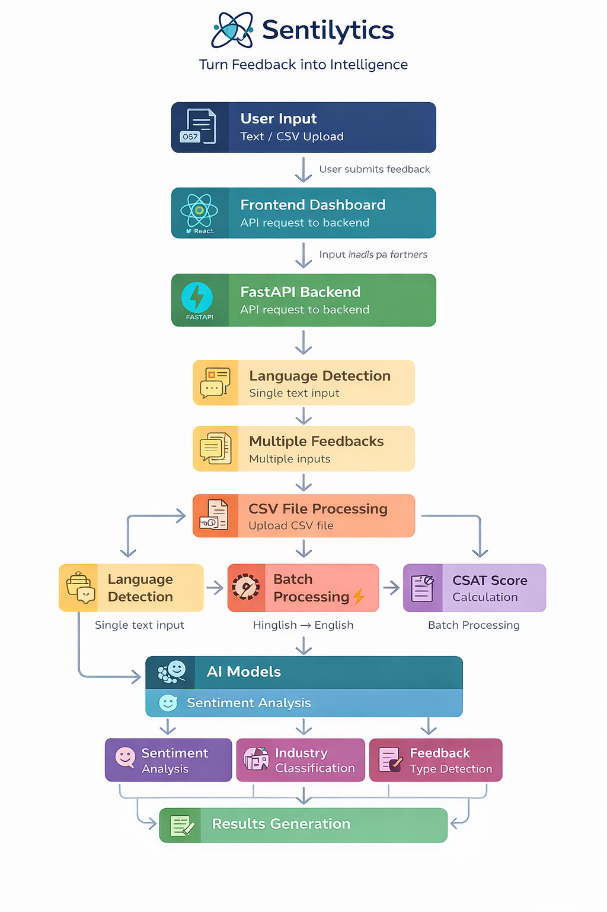

# 🚀 Sentilytics – AI-Powered Feedback Intelligence Platform

<p align="center">
  
  
  
  
</p>

<p align="center">
  Transform raw feedback into actionable insights using AI, NLP, and real-time analytics.
</p>

---

## ✨ Overview

**Sentilytics** is an intelligent feedback analysis platform that leverages **Machine Learning and Natural Language Processing (NLP)** to automatically analyze user opinions, detect sentiment, and visualize insights.

It is designed to help businesses, educators, and developers **understand user feedback at scale** — whether it's text input, datasets, or YouTube comments.

---

## 🎯 Key Highlights

- 🧠 AI-driven sentiment classification  
- 📊 Real-time interactive analytics dashboard  
- 🎥 YouTube comment sentiment analysis  
- 💳 Credit-based usage system  
- 📁 Bulk dataset processing  
- ⚡ Fast, scalable, and extensible architecture  

---

## 🧩 Core Features

### 🔍 Sentiment Analysis Engine
- Classifies feedback into:
  - Positive ✅  
  - Negative ❌  
  - Neutral ⚖️  
- Built using **Scikit-learn models**
- Optimized with **TF-IDF vectorization**

---

### 📊 Analytics Dashboard
- Clean and interactive visualizations  
- Sentiment distribution charts  
- Insightful breakdown of feedback patterns  

---

### 🎥 YouTube URL Analysis *(Advanced Feature)*
Analyze public opinion directly from YouTube:

- Paste any video URL  
- Extract comments automatically  
- Run sentiment analysis on audience feedback  

**Output includes:**
- Sentiment distribution  
- Trend insights  
- Audience reaction patterns  

---

### 💳 Credit System *(System Design Feature)*
A built-in usage control mechanism:

| Action | Credits Used |
|------|-------------|
| Single Prediction | 1 Credit |
| Dataset Analysis | Variable |
| YouTube Analysis | Higher Credits |

**Why it matters:**
- Prevents misuse  
- Enables scalability  
- Supports future monetization  

---

### 🧾 Multi-Input Support
- ✍️ Manual text feedback  
- 📁 CSV dataset upload  
- 🎥 YouTube URL input  

---

### 🔐 Authentication *(If Enabled)*
- User login/signup  
- Credit tracking  
- Personalized experience  

---

## 🏗️ Tech Stack

| Layer | Technology |
|------|-----------|
| Frontend | React.js, Tailwind CSS |
| Backend | Flask (Python) |
| ML/NLP | Scikit-learn, Pandas, NumPy |
| Visualization | Recharts / Matplotlib |
| Database | MongoDB / MySQL |

---

## ⚙️ System Architecture

User Input → Preprocessing → ML Model → Prediction → Visualization → Credit Deduction

---

## 📂 Project Structure
sem_4_project/
│
├── backend/
│ ├── app.py
│ ├── model/
│ ├── utils/
│
├── frontend/
│ ├── components/
│ ├── pages/
│
├── dataset/
├── README.md

---

## ⚙️ Installation & Setup

1️⃣ Clone Repository
```bash
git clone https://github.com/Tanyagoyal14/sem_4_project.git
cd sem_4_project

2️⃣ Backend Setup
cd backend
pip install -r requirements.txt
python app.py

3️⃣ Frontend Setup
cd frontend
npm install
npm run dev

🔄 How It Works
User provides input (text / dataset / YouTube URL)
Data is cleaned and preprocessed
ML model predicts sentiment
Results are visualized
Credits are deducted
💳 Credit System – Deep Dive
Each user starts with predefined credits
Every operation consumes credits
Ensures fair usage and system efficiency

Future Scope:

Subscription model
Credit recharge system
Tier-based access
🎥 YouTube Processing Pipeline
URL → Video ID Extraction → Comment Fetching → NLP Processing → Sentiment Output


📈 Flowchart

<p align="center">
  
</p>

<p align="center">
  <i>End-to-end workflow of the Sentilytics feedback analysis pipeline</i>
</p>


👨‍💻 Team Members
Ayushi Bansal
Tanya Goyal
Tanisha Tayal

🔮 Future Enhancements
🤖 Transformer models (BERT, LLMs)
🌐 Full cloud deployment (Vercel + AWS)
📊 Advanced analytics & reporting
📱 Mobile-first UI
🔔 Smart alerts & notifications

📜 License

This product is developed for academic and learning purposes.

💡 Acknowledgements
Scikit-learn
React.js
Open-source community


📬 Contact
GitHub: https://github.com/Ayushibansal805, https://github.com/Tanyagoyal14

<p align="center"> ⭐ If you found this project useful, consider giving it a star! </p> ```

